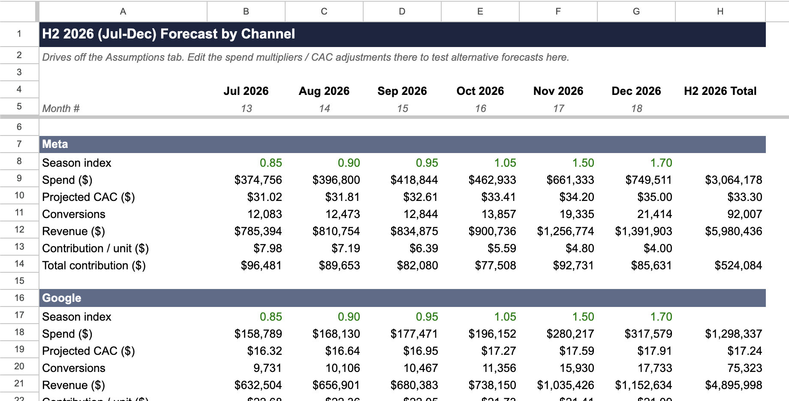

[README.md](https://github.com/user-attachments/files/30168292/README.md)
# eCommerce Revenue Forecast & Media Mix Model

A six-month revenue forecast and media-mix model built for a single-product consumer hardware brand — a device that helps people break phone-addiction habits by locking distracting apps. The brand sells DTC through its own store and, since March 2026, on Amazon, with paid media running across Meta, Google, TikTok, and Amazon.

**[View the live model →](INSERT_GOOGLE_SHEET_VIEW_LINK_HERE)**

## What the model does

**1. Forecast and levers.** Projects H2 2026 (Jul–Dec) revenue against a target of +20% growth over the trailing six months, using stated seasonality, spend, and CAC-trend assumptions. Forecast comes in at $15.4M, ~15% ahead of the $13.3M target.

It also isolates which lever moves revenue more: a 10% increase in spend, or a 0.5-point improvement in blended conversion rate. The CVR lever wins by a wide margin — it delivers roughly **1.9x the revenue lift of the spend increase, with zero added CAC** — because spend growth is bounded by worsening marginal efficiency, while a CVR gain compounds across every existing visitor for free.

**2. The strategic call.** Meta is the standout underperformer: 57% of spend but only 26% of contribution, with CAC up 41% year-over-year — the worst spend-to-contribution ratio in the portfolio. The call isn't to pause it (no channel is contribution-negative), but to cut its share from 57% to 20% and redirect budget toward Google, which drives 48% of contribution on 21% of spend and carries the highest contribution per unit ($22) in the mix. At the same total budget, the reallocation model shows **+48% contribution and +21% revenue**.

**3. Pressure test.** Models ~15% media inflation next quarter against a target of holding blended MER at or below 35%. Holding spend flat and absorbing the CAC increase fails on both counts — MER blows through to 42% and revenue drops 13%, since inflation raises cost equally across every channel while volume falls. Reallocating that same budget toward the more efficient channels holds blended MER at 34.1% and grows revenue +7% instead.

## Key assumptions

- Average order value held constant at $65; gross margin 60% (DTC) with a 15% Amazon marketplace fee.
- H2 2026 seasonality assumed to repeat the Jul–Dec 2025 pattern — the only full year of data available, including BFCM and Holiday peaks.
- Amazon's H2 seasonality is treated as the single biggest open assumption in the model, since the channel only launched in March 2026 and has no prior BFCM/Holiday data of its own.
- Marginal ROAS on incremental spend is modeled as linear/naive by design and flagged as an upper bound — real marginal returns are almost certainly lower given the worsening CAC trend on Meta and Google.

## How it's built

Every blue cell is an editable input, every black cell is a calculation, and green cells link to another tab — change an assumption on the Assumptions tab and everything downstream recalculates. Tabs: Overview, Assumptions, H2 2026 Forecast, Levers & Elasticity, Channel Scorecard, Pressure Test, Monthly Data, Blended Summary, Unit Economics & Calendar, and Data Dictionary.

A copy of the workbook (`eCommerce_Forecast_Quinn.xlsx`) is included in this repo for anyone who'd rather open it directly than view it in Google Sheets.
