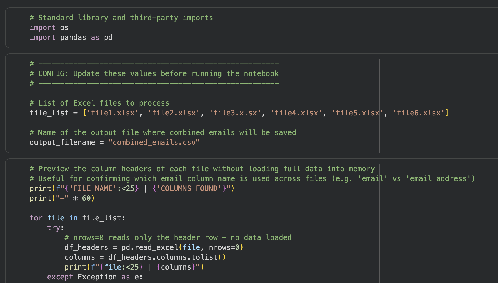

# Email List Combiner & Deduplicator

A Python script that takes a batch of Excel files with inconsistent column naming — the kind of mess you get combining lead lists from different tools or teams — and outputs a single clean, deduplicated CSV of email addresses.

**[Open in Colab →](https://colab.research.google.com/github/quinn-dolan/portfolio/blob/main/assets/docs/combine_large_email_lists.ipynb)**

## What it does

Given a list of Excel files, the script first previews just the header row of each one (`nrows=0`) so it can confirm which email column name each file uses — `email`, `email_address`, or others — without loading any actual data into memory. That matters once files get large; reading full sheets just to check column names wastes time and memory.

It then loads only the identified email column per file, standardizes the column name across files, drops blanks and in-file duplicates, and concatenates everything into one DataFrame. A final dedupe pass catches emails that show up in more than one source file before writing the result to a single CSV.

## Why it's built this way

Two things make this more than a one-off `pandas.concat()`: it never loads a full sheet into memory when it only needs one column, and it tolerates files that don't share identical schemas — a common real-world snag when lists come from different export tools. Both are easy to overlook until a file is too large or a merge silently drops rows because a column name didn't match.

## Stack

Python, pandas.
