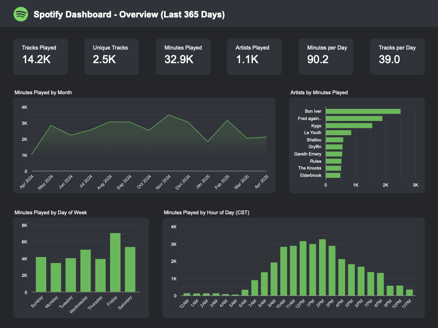

# Spotify Listening Habits: EDA & Dashboard

A Looker Studio dashboard built on my own Spotify Extended Streaming History — a year of raw play-by-play data turned into an interactive view of what I actually listen to, and when.

**[View the dashboard →](https://drive.google.com/file/d/1BpKccC3qK1_FTypWOSV0JM7mKZf6aZr7/view?usp=sharing)**

## What's in it

**Overview.** Total minutes and tracks played over the trailing 365 days, plus listening broken down by day of week and hour of day (CST) to surface daily rhythm — mornings, commute windows, evening wind-down.

**Artist deep dive.** A filterable view (by artist) showing minutes played by month, top tracks, and day-of-week patterns for any artist in the library — useful for spotting whether a favorite is a steady habit or a binge tied to a specific release.

**Month deep dive.** The same slice-and-dice, but by calendar month — top tracks and artists for any given month, plus each artist's share of total play time that month.

**Other listening habits.** A skip-rate view bucketing plays into time-listened categories (<5s, <15s, <30s, <90s, 90s+) by artist, to separate tracks I actually sit through from ones I skip past.

## How it's built

Spotify's own streaming history export, cleaned and shaped for Looker Studio, with parameter controls driving the artist- and month-filtered views so the dashboard stays interactive rather than a static set of charts.
